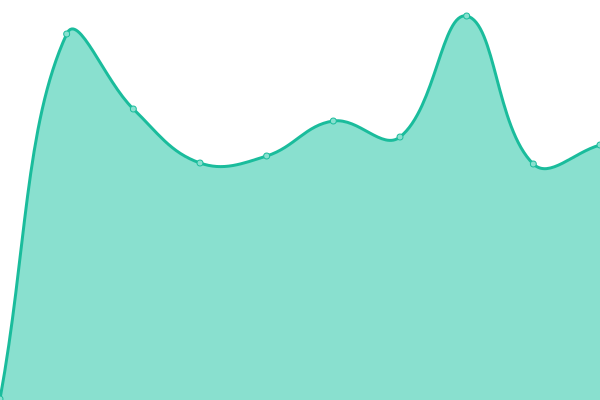
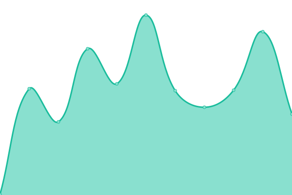

# [📈 Live Status](https://bdlangton.github.io/uptime): <!--live status--> **🟩 All systems operational**

This repository contains the open-source uptime monitor and status page for [Barrett Langton](http://langton.dev), powered by [Upptime](https://github.com/upptime/upptime).

With [Upptime](https://upptime.js.org), you can get your own unlimited and free uptime monitor and status page, powered entirely by a GitHub repository. We use [Issues](https://github.com/bdlangton/uptime/issues) as incident reports, [Actions](https://github.com/bdlangton/uptime/actions) as uptime monitors, and [Pages](https://bdlangton.github.io/uptime) for the status page.

<!--start: status pages-->
<!-- This summary is generated by Upptime (https://github.com/upptime/upptime) -->
<!-- Do not edit this manually, your changes will be overwritten -->

| URL                                                  | Status | History                                                                                                   | Response Time                                                                          | Uptime                                                                                                                                                                                                                       |
| ---------------------------------------------------- | ------ | --------------------------------------------------------------------------------------------------------- | -------------------------------------------------------------------------------------- | ---------------------------------------------------------------------------------------------------------------------------------------------------------------------------------------------------------------------------- |
| [Langton.dev](https://langton.dev)                   | 🟩 Up  | [langton-dev.yml](https://github.com/bdlangton/uptime/commits/master/history/langton-dev.yml)             |  241ms       |              |
| [Commonplace Books](https://commonplace.langton.dev) | 🟩 Up  | [commonplace-books.yml](https://github.com/bdlangton/uptime/commits/master/history/commonplace-books.yml) |  283ms |  |
| [Strava App](https://strava.langton.dev)             | 🟩 Up  | [strava-app.yml](https://github.com/bdlangton/uptime/commits/master/history/strava-app.yml)               |  243ms        |                |

<!--end: status pages-->

[**Visit our status website →**](https://bdlangton.github.io/uptime)

## 📄 License

- Code: [MIT](./LICENSE) © [Barrett Langton](http://langton.dev)
- Data in the `./history` directory: [Open Database License](https://opendatacommons.org/licenses/odbl/1-0/)
