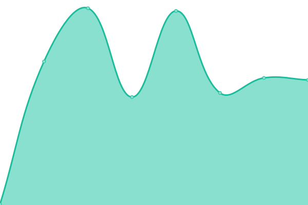

# [📈 Live Status](https://bdlangton.github.io/uptime): <!--live status--> **🟩 All systems operational**

This repository contains the open-source uptime monitor and status page for [Barrett Langton](http://langton.dev), powered by [Upptime](https://github.com/upptime/upptime).

With [Upptime](https://upptime.js.org), you can get your own unlimited and free uptime monitor and status page, powered entirely by a GitHub repository. We use [Issues](https://github.com/bdlangton/uptime/issues) as incident reports, [Actions](https://github.com/bdlangton/uptime/actions) as uptime monitors, and [Pages](https://bdlangton.github.io/uptime) for the status page.

<!--start: status pages-->
<!-- This summary is generated by Upptime (https://github.com/upptime/upptime) -->
<!-- Do not edit this manually, your changes will be overwritten -->
<!-- prettier-ignore -->
| URL | Status | History | Response Time | Uptime |
| --- | ------ | ------- | ------------- | ------ |
|  [Langton.dev](https://langton.dev) | 🟩 Up | [langton-dev.yml](https://github.com/bdlangton/uptime/commits/HEAD/history/langton-dev.yml) | 

 1265ms
     
 | 

<a href="https://status.langton.dev/history/langton-dev">98.58%</a>
    

|  [Commonplace Books](https://commonplace.langton.dev) | 🟩 Up | [commonplace-books.yml](https://github.com/bdlangton/uptime/commits/HEAD/history/commonplace-books.yml) | 

 808ms
     
 | 

<a href="https://status.langton.dev/history/commonplace-books">99.39%</a>
    

|  [Strava App](https://strava.langton.dev) | 🟩 Up | [strava-app.yml](https://github.com/bdlangton/uptime/commits/HEAD/history/strava-app.yml) | 

 760ms
     
 | 

<a href="https://status.langton.dev/history/strava-app">98.50%</a>
    

|  [Manhattan Rental Properties](https://manhattanrentalproperties.net) | 🟩 Up | [manhattan-rental-properties.yml](https://github.com/bdlangton/uptime/commits/HEAD/history/manhattan-rental-properties.yml) | 

 369ms
     
 | 

<a href="https://status.langton.dev/history/manhattan-rental-properties">100.00%</a>
    

|  Jenkins | 🟩 Up | [jenkins.yml](https://github.com/bdlangton/uptime/commits/HEAD/history/jenkins.yml) | 

 847ms
     
 | 

<a href="https://status.langton.dev/history/jenkins">98.84%</a>
    

|  RabbitMQ | 🟩 Up | [rabbit-mq.yml](https://github.com/bdlangton/uptime/commits/HEAD/history/rabbit-mq.yml) | 

 1049ms
     
 | 

<a href="https://status.langton.dev/history/rabbit-mq">99.15%</a>
    

|  NextCloud | 🟩 Up | [next-cloud.yml](https://github.com/bdlangton/uptime/commits/HEAD/history/next-cloud.yml) | 

 1066ms
     
 | 

<a href="https://status.langton.dev/history/next-cloud">98.58%</a>
    

|  OnlyOffice | 🟩 Up | [only-office.yml](https://github.com/bdlangton/uptime/commits/HEAD/history/only-office.yml) | 

 396ms
     
 | 

<a href="https://status.langton.dev/history/only-office">97.72%</a>
    

<!--end: status pages-->

[**Visit our status website →**](https://bdlangton.github.io/uptime)

## 📄 License

- Code: [MIT](./LICENSE) © [Barrett Langton](http://langton.dev)
- Data in the `./history` directory: [Open Database License](https://opendatacommons.org/licenses/odbl/1-0/)
